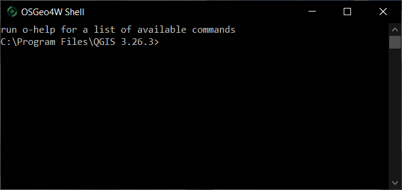

Installation and Setup Instructions
===================================

Follow the instructions for your operating system, below.

- [Windows 10](#Windows-10)
- [Mac OS X](#GNU-Linux-or-Mac-OS-X)
- [GNU Linux](#GNU-Linux-or-Mac-OS-X)


Windows 10
-------------------

**First, make sure you know your Windows username.**

- *If you don't know your Windows username, instead type the following and hit ENTER:*
```
whoami
```

The result of this command might be something like `organization\username`; your Windows username, in this example, would be `username`.

**Next, we need to install Python.**

- [Download the latest stable release for Windows.](https://www.python.org/downloads/windows/)

**Then, you need to install the Python libraries we will be using.**

- Open the Windows PowerShell; from the **"Start"** menu, you can start typing "PowerShell" and click on the application icon when it appears.
- A command-line interface should appear. It should look *similar* to the screenshot below, although the text in your window may be slightly different.



- Type the following and hit ENTER to install the necessary Python libraries:
```
pip install numpy scipy notebook xarray earthaccess h5py h5netcdf cartopy pyproj dask
```


### Starting Jupyter Notebook

**To launch Jupyter Notebook,** first change your working directory to your home folder by typing the following, making sure to replace `username` with your actual Windows username:
```
cd C:/Users/username
```

You can start Jupyter Notebook by typing the following, then hit ENTER:
```
python -m notebook
```


### Alternatives to `pip`

We do not recommend using `conda` or `miniconda`. If you'd like to use a different Python package manager, we recommend `mamba`, installed through `mambaforge`.

**On Windows:**

- Download and run the `mambaforge` installed, [from here.](https://github.com/conda-forge/miniforge#mambaforge)
- Launch the **Miniforge Prompt** by typing "miniforge" from the Start or search menu.
- At the Miniforge Prompt's command line, type the following, hitting ENTER after each line.

```
mamba install numpy scipy notebook xarray earthaccess h5py h5netcdf cartopy pyproj dask
pip install --force pillow
```

**On Mac OS X:**

- Open a new **Terminal** window.
- Install `mamba` ("miniforge") by [following the instructions here.](https://github.com/conda-forge/miniforge?tab=readme-ov-file#unix-like-platforms-mac-os--linux)
- If `mamba` ("miniforge") was installed to your Home directory, e.g., `/Users/username/miniforge3`, where `username` is your username, then you can *initialize* `mamba` with:
```
/Users/username/miniforge3/bin/mamba init
```
- Then, anytime you want to use or install Python modules, open a **Terminal** window and type:
```
mamba activate
```

**On Windows or Mac OS X:**

You can start Jupyter Notebook from the Miniforge Prompt by typing the following and hitting ENTER:
```
python -m notebook
```


GNU Linux or Mac OS X
---------------------

Python and `pip` should already be installed. From the Mac OS X or Linux **Terminal,** you can install Python dependencies by:

```sh
pip install numpy scipy notebook xarray earthaccess h5py h5netcdf cartopy
```


### Starting Jupyter Notebook

**To launch Jupyter Notebook,** type the following at the command line, making sure that your current working directory is where you want the Jupyter file tree to start:

```sh
jupyter notebook
```
